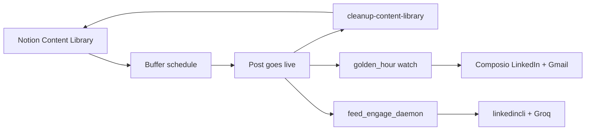

# LinkedIn Automation

Cursor Agent skills and Python/bash automation for a LinkedIn content pipeline: **schedule and publish** from Notion, **golden-hour replies** on your own posts, and **proactive feed engagement** on others' posts.

Built for macOS + [Cursor](https://cursor.com) with MCP integrations (Notion, Buffer, browser) and optional launchd scheduling.

## What it does

| Module | Role |
|--------|------|
| [`linkedin-content-posting/`](linkedin-content-posting/) | Draft, schedule, publish from Notion Content Library via Buffer MCP; post-live Notion sync |
| [`linkedin-golden-hour/`](linkedin-golden-hour/) | Auto-reply to comment notifications on **your** posts during the 90-minute golden hour |
| [`linkedin-feed-engage/`](linkedin-feed-engage/) | Proactive comments on others' posts via **CLI daemon** (default) or legacy Cursor browser MCP |
| [`lib/notion_sync.py`](lib/notion_sync.py) | Shared Notion ↔ Buffer reconciliation |
| [`scripts/`](scripts/) | Publish-day watcher, launchd installer, optional Cursor SDK trigger |
| [`launchd/`](launchd/) | macOS schedule templates |

### Publish-day flow



On publish days (Tue–Thu by default), `publish_day_watch.sh` runs every 10 minutes for 90 minutes:

1. **Notion sync** — Buffer `sent` → Notion status **Posted**
2. **Golden hour** — Gmail comment detection → Composio reply on your post
3. **Feed engage** — hands-off daemon comments via linkedincli + Groq (see [docs/FEED_ENGAGE_DAEMON.md](docs/FEED_ENGAGE_DAEMON.md))

## Prerequisites

- **macOS** (launchd scheduling)
- **Python 3.10+**
- **[Cursor](https://cursor.com)** with Agent mode
- **MCP servers** (configure in `~/.cursor/mcp.json`):
  - Notion workspace
  - Buffer (`https://mcp.buffer.com/mcp`)
  - Cursor IDE browser (built-in)
- **[Composio CLI](https://docs.composio.dev)** — LinkedIn comment API + Gmail (`composio link`)
- **Accounts:** Notion integration, Buffer org with LinkedIn channel, LinkedIn logged in in browser

### Environment variables

Set in `~/.zshrc` (never commit secrets). See [`.env.example`](.env.example).

| Variable | Required | Purpose |
|----------|----------|---------|
| `BUFFER_MCP_TOKEN` | Yes (CLI/launchd) | Buffer GraphQL API |
| `NOTION_TOKEN` | Yes (CLI/launchd) | Notion API (or `NOTION_API_KEY`) |
| `NOTION_CONTENT_LIBRARY_DB` | Optional (CLI/launchd) | Content Library database ID (defaults to `753369dc15fb4b3c82dd9c88cb753c3c`) |
| `LINKEDIN_ACTOR_ID` | For Composio replies | Your LinkedIn member ID |
| `GROQ_API_KEY` | For feed daemon | Groq LLM (free tier: `llama-3.3-70b-versatile`) |
| `OPENROUTER_API_KEY` | Optional | If `llm.provider=openrouter` in config |
| `LINKEDIN_LI_AT` / `LINKEDIN_JSESSIONID` | For feed daemon | linkedincli session cookies |
| `CURSOR_API_KEY` | Optional | Legacy browser feed engage only |

## Quick start

```bash
git clone https://github.com/ItsRRM97/LinkedIn-Automation.git
cd LinkedIn-Automation

# Local config (gitignored)
cp linkedin-golden-hour/config.example.json linkedin-golden-hour/config.json
# Edit buffer_organization_id, linkedin_channel_id, linkedin_actor_id

# Add env vars to ~/.zshrc (see .env.example), then:
source ~/.zshrc

# Manual golden-hour watch
python3 linkedin-golden-hour/golden_hour.py watch

# Content Library cleanup (run before schedule/publish or on publish day)
python3 linkedin-golden-hour/golden_hour.py cleanup-content-library

# Install publish-day launchd job (Tue–Thu 10:00 local)
bash scripts/install_publish_day_schedule.sh
```

**On publish day:** Mac awake · Cursor open · LinkedIn logged in at [linkedin.com/feed/](https://www.linkedin.com/feed/).

## Skills index

Each folder has a `SKILL.md` for Cursor Agent workflows:

| Skill | Path | Use when |
|-------|------|----------|
| Content posting | [linkedin-content-posting/SKILL.md](linkedin-content-posting/SKILL.md) | Schedule/publish, Content Library cleanup |
| Golden hour | [linkedin-golden-hour/SKILL.md](linkedin-golden-hour/SKILL.md) | Auto-replies on your post comments |
| Feed engage | [linkedin-feed-engage/SKILL.md](linkedin-feed-engage/SKILL.md) | Proactive feed comments via browser |

## Configuration

### Golden hour — `linkedin-golden-hour/config.json`

Copy from [`config.example.json`](linkedin-golden-hour/config.example.json).

| Field | Description |
|-------|-------------|
| `buffer_organization_id` | Buffer workspace ID |
| `linkedin_channel_id` | Buffer LinkedIn channel ID |
| `linkedin_actor_id` | LinkedIn member ID for Composio replies |
| `golden_hour_minutes` | Window after publish (default `90`) |
| `gmail_since_hours` | Gmail lookback for comment emails |
| `skip_buffer_post_ids` | Post IDs to ignore |
| `skip_text_contains` | Skip posts whose caption contains these strings |

**Campaign overrides:** add `linkedin-golden-hour/campaigns/<id>.json` (see [`example-campaign.json`](linkedin-golden-hour/campaigns/example-campaign.json)) for rich reply context matched by `buffer_post_id`.

### Feed engage — `linkedin-feed-engage/config.json`

| Field | Description |
|-------|-------------|
| `target_mode` | `thought_leaders` or home-feed `top` |
| `target_comments` | Comments per session (default `30`) |
| `session_minutes` | Max session duration |
| `min_delay_seconds` / `max_delay_seconds` | Pace between comments |
| `thought_leaders_file` | Roster JSON for leader discovery |
| `phase1_approval_limit` | `0` = fully automatic |
| `continuous_mode` | Run without batch approval stops |

### Runtime state (gitignored)

| Path | Purpose |
|------|---------|
| `linkedin-golden-hour/state/` | Per-campaign tick state |
| `linkedin-feed-engage/state/session-*.json` | Feed engage session progress |
| `linkedin-feed-engage/state/feed_engage_armed.json` | Armed agent metadata |
| `logs/` | Watch script logs |

Examples: [`campaign.example.json`](linkedin-golden-hour/state/campaign.example.json), [`session.example.json`](linkedin-feed-engage/state/session.example.json).

## CLI reference

```bash
# Golden hour
python3 linkedin-golden-hour/golden_hour.py watch [--dry-run]
python3 linkedin-golden-hour/golden_hour.py tick --campaign CON-138
python3 linkedin-golden-hour/golden_hour.py cleanup-content-library [--dry-run]

# Feed engage daemon (hands-off)
python3 linkedin-feed-engage/feed_engage_daemon.py [--dry-run]

# Legacy feed engage trigger (browser mode only)
python3 linkedin-feed-engage/feed_engage_trigger.py [--dry-run]

# Post-live sync wrapper
python3 linkedin-content-posting/post_live_sync.py [--dry-run]
```

## Safety and disclaimer

- **LinkedIn Terms of Service:** Automation may violate LinkedIn's policies. Use at your own risk; keep volume human-like and review outputs.
- **Rate limits:** Scripts pace comments and replies; do not remove delays or run multiple sessions in parallel.
- **No secrets in git:** Tokens live in `~/.zshrc` or your secret manager. Runtime state is gitignored.
- **Browser sessions:** Feed engage requires an authenticated LinkedIn session; stop on captcha or auth failures.
- **Not affiliated** with LinkedIn, Buffer, or Notion.

## License

MIT — see repository for details. Contributions welcome via pull request.
